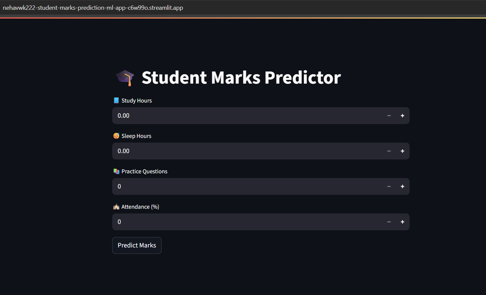

# 🎓 Student Marks Prediction ML Web App

This project is a **machine learning web app** that predicts a student's marks based on:

- Study Hours
- Sleep Hours
- Practice Questions Solved
- Class Attendance

🔍 Built using:
- Python
- Scikit-Learn (Linear Regression)
- Streamlit (for frontend)
- Deployed on Streamlit Cloud

---

## 🚀 How It Works

1. User inputs 4 values (Hours, Sleep, Practice, Attendance)
2. Linear Regression model predicts final marks
3. Prediction displayed instantly on screen

---

## 📊 Sample Input Example

| Feature            | Value  |
|--------------------|--------|
| Study Hours        | 6      |
| Sleep Hours        | 7      |
| Practice Questions | 15     |
| Attendance (%)     | 85     |

📈 **Predicted Marks**: ~70+

---

## 📁 Files in This Repo

| File              | Description                            |
|-------------------|----------------------------------------|
| `app.py`          | Main Streamlit web app script          |
| `requirements.txt`| Python libraries required to run app   |
| `README.md`       | Project documentation (this file)      |

---

## 🌐 Live Demo

👉 [Live App on Streamlit](https://student-marks-prediction-ml.streamlit.app)

---

## 👩‍💻 Author

**Neha Vishwakarma**  
Beginner in ML | Building projects for career growth  
GitHub: [@nehavwk222](https://github.com/nehavwk222)

## 📸 App Preview

